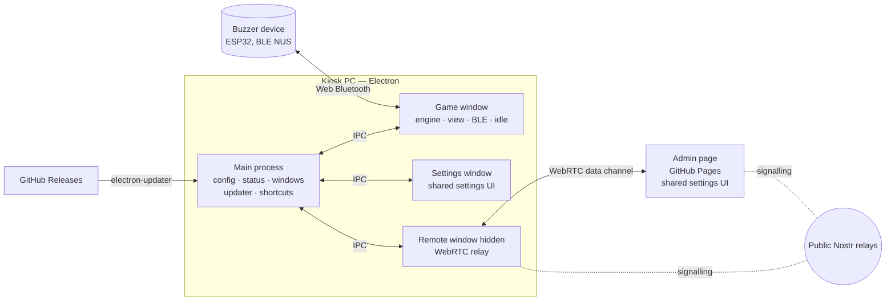
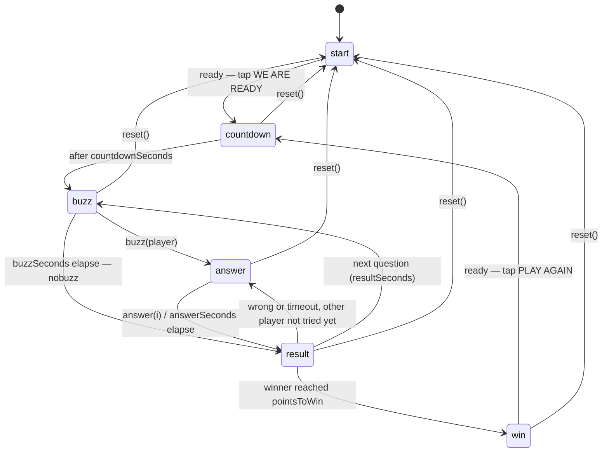

# Standoff — Architecture

Standoff is a two-player buzzer quiz for a portrait touchscreen kiosk. It's an Electron app for Windows. Players buzz in with two physical Bluetooth buttons, answer by tapping the screen, and the first player to reach the target score (default 2) wins. An optional admin web page on GitHub Pages can mirror and edit the kiosk's settings over WebRTC.

This document is for whoever changes the app next. It explains how the pieces fit together, why they were built that way, and how to extend them.

---

## 1. The big picture



Four rules shape the design:

1. **The main process owns the truth.** Configuration (settings, theme, questions) and the aggregated status live in the main process. Every window reads and writes through the same small IPC API.
2. **The game rules are a pure state machine** (`src/shared/game-engine.js`) with no DOM, hardware or timer dependencies, so they are unit-tested.
3. **One settings UI, two transports.** The settings window and the admin page mount the same code (`src/shared/settings-ui/`). The only difference is the transport object: Electron IPC in one, WebRTC in the other. That's why the admin page is an exact mirror of the kiosk settings.
4. **The kiosk works fully offline.** The admin link and auto-updates are optional extras; nothing in the game depends on them.

---

## 2. Repository layout

```
admin/                     Admin page (GitHub Pages): connect screen + WebRTC transport
src/
  main/                    Electron main process (Node, ES modules)
    main.js                entry: lifecycle, IPC, commands, shortcuts, autostart
    windows.js             BrowserWindow factories (game / settings / remote), kiosk vs dev
    config-store.js        JSON config persistence (atomic writes)
    bluetooth.js           device chooser, pairing handler, user-gesture scan trigger
    updater.js             electron-updater wrapper (install only when idle)
    build-info.js          room / PIN / commit baked in by CI
    preload.cjs            the window.standoff bridge (sandboxed, CommonJS)
  renderer/                Vite root for kiosk windows (built into dist/renderer)
    game/                  game window: main.js, view.js, ble.js, idle.js, hidden-button.js, game.css
    settings/              settings window bootstrap
    remote/                hidden WebRTC relay window
    browser-shim.js        fake window.standoff for opening pages in a normal browser
  shared/                  used by main, renderers and admin
    defaults.js            config schema, defaults, normalizeConfig, brand colours
    game-engine.js         game rules state machine
    questions.js           sample questions, QuestionDeck (shuffle without repeats)
    excel.js               Excel/CSV import + export (SheetJS)
    protocol.js            IPC channel names, commands, remote message names
    settings-ui/           shared settings UI + CSS
  assets/                  fonts (Clash Display), logo, backgrounds
scripts/                   dev runner, CI build-info writer
test/                      node:test unit tests (engine, config, Excel)
build/icon.png             app/installer icon
electron-builder.yml       installer + update-feed config
.github/workflows/         release (Windows installer), admin-pages, ci
assets/, reference/        original design material (not shipped)
```

---

## 3. Processes, windows and IPC

| Window | File | Visible | Responsibility |
|---|---|---|---|
| **Game** | `renderer/game` | always | Runs the engine, renders screens, owns the BLE connection, idle watchdog and hidden button. Packaged builds run fullscreen kiosk; dev runs a 540×960 window. |
| **Settings** | `renderer/settings` | on demand | Shared settings UI over IPC. Opens as a separate window on top of the game (`parent: game`, always on top in kiosk mode). |
| **Remote** | `renderer/remote` | never | Joins the admin WebRTC room and relays admin messages to the same IPC API. Kept separate so a game reload never drops the admin link, and vice versa. |

Every renderer runs sandboxed with `contextIsolation`. Its only access to the system is `window.standoff`, defined in `src/main/preload.cjs`:

| Method | Direction | Purpose |
|---|---|---|
| `getConfig()` / `setConfig(patch)` | invoke | Read the config, or deep-merge a patch into it. Main normalizes, persists and broadcasts it. |
| `onConfig(cb)` | main → all | Fires after every config change. |
| `getStatus()` / `reportStatus(partial)` / `onStatus(cb)` | both | Aggregated status. Each renderer may only report the sections it owns: game → `game`, `ble`; remote → `remote`. Main owns `app` and `update`. |
| `command(name, args)` | invoke | Commands from `protocol.js → COMMANDS`. Commands arriving from the remote window are only allowed if marked `remote: true`, so the admin can't quit the app. |
| `onGameCommand(cb)` | main → game | `reset`, `ble:reconnect`, `ble:unavailable`. |
| `bleScan()` | game → main | Asks main to run the BLE scan with a user gesture (see §6). |
| `getRemoteParams()` | invoke | `{ enabled, room, pin, appId }` for the remote window. |

> `preload.cjs` repeats the channel names from `protocol.js` because sandboxed preloads can't import ES modules. Keep the two in sync.

**Status shape** (shown in the settings status bar and on the admin page):

```js
{
  app:    { version, packaged, platform, hostname, commit },
  game:   { screen, scores, questionNumber, player, questionId },
  ble:    { state, device, error, deviceState, lastButton },
  update: { state, version, progress, error },
  remote: { state, room, admins, error },
}
```

---

## 4. Configuration

- **Where:** `%APPDATA%/Standoff/config.json` (Electron `userData`). It's written atomically (temp file + rename), and a corrupt file is copied aside and replaced with defaults.
- **Schema and defaults:** `src/shared/defaults.js → DEFAULT_CONFIG`. Sections: `game`, `kiosk`, `theme`, `ble`, `remote`, `questions`.
- **Patch semantics:** `setConfig(patch)` deep-merges objects, and arrays replace wholesale. So `{ questions: [...] }` replaces all questions, and `{ theme: { colors: { red: '#f00' } } }` changes one colour.
- **Validation:** every stored or received config goes through `normalizeConfig()`, which fills missing keys, clamps numbers, drops invalid questions and rejects non-image logos. Anything from the admin page is therefore safe by construction.
- **Questions:** `{ id, text, answers: [4 strings], correct: 0..3 }`.
- **Logo:** stored as a `data:image/...` URL inside the config. Uploads are scaled down to 1000 px so config and WebRTC messages stay small. `null` means the bundled logo.

### Adding a setting (checklist)

1. Add the default to `DEFAULT_CONFIG` and a clamp/validation line in `normalizeConfig`.
2. Use it (`config.<section>.<key>`) wherever it matters. Config changes are pushed live to every window.
3. Add a field in the right tab of `src/shared/settings-ui/settings-ui.js` (`numberField`, `toggleField` or `textField`). It then appears in the settings window and on the admin page at the same time.
4. If the change is incompatible with older admin pages or kiosks, bump `CONFIG_SCHEMA_VERSION` or `REMOTE_PROTOCOL_VERSION` (see §7).

---

## 5. Game engine

`GameEngine` (`src/shared/game-engine.js`) is a small state machine. The game window feeds it events and re-renders on every state change.



**Rules as agreed**

| Topic | Behaviour | Setting |
|---|---|---|
| Buzzing | The first `BTN` from the device during `buzz` wins the right to answer. The device reports which player (1 or 2) pressed. | `game.buzzSeconds` (10) |
| Answering | Tap A–D within the time limit. | `game.answerSeconds` (10) |
| Wrong answer or timeout | The other player gets one chance with a fresh timer, without buzzing. After that the question closes, the correct answer is revealed, and the next question starts. | `game.stealOnWrong`, `game.handoverSeconds` |
| Nobody buzzes | Show the correct answer, then the next question. | — |
| Winning | First to `pointsToWin`. | `game.pointsToWin` (3) |
| Question order | Random with no repeats; the deck reshuffles when it runs out, and never repeats the last question straight away. | — |
| "01 OF 05" | "OF NN" is shown while the question number ≤ `displayTotal`, then hidden ("06", "07"…). While answering, the label shows "PLAYER N" instead, as in the concept. | `game.displayTotal` (5) |
| Colours | Question N uses `accentOrder[(N−1) % length]`: yellow, green, red, purple, blue, then repeat. | `theme.accentOrder` |

**Side effects** leave the engine through `onEffect`. There are two: `{ type: 'arm' }`, which the game window turns into `START` for the buzzer device when a question appears, and `{ type: 'disarm' }` → `STOP`, sent when the buzz time runs out with no press or when the game returns to the start screen from an armed question.

**Timers** are injected (`clock`), so tests run instantly. See `test/game-engine.test.js`.

### Rendering

`src/renderer/game/view.js` holds pure template functions, one per screen. The stage is a fixed **1080×1920 design canvas**, scaled to fit the actual display (`--scale`), so layouts are pixel-stable on any resolution. Design pixels are the concept images ×1.2. Live values (remaining seconds, the timer ring) update ten times a second through `tick()` without re-rendering.

The client feedback on the concepts is built into the CSS (marked in `game.css`):

1. The timer number is centred in the ring (the label is absolutely centred over the SVG).
2. The winner screen's texts are separate rows with no overlap, and the star sits beside "N WINS!".
3. The answers use an equal 2×2 grid, so B and D are as wide as A and C.

---

## 6. Kiosk behaviour

| Behaviour | Where | Notes |
|---|---|---|
| Fullscreen kiosk | `windows.js → isKiosk()` | On in packaged builds or with `STANDOFF_KIOSK=1`. Dev runs windowed. Alt+F4 is blocked in kiosk mode (close is prevented unless the app is quitting). |
| Settings shortcut | `main.js → attachShortcuts` | Ctrl/Cmd + `,` toggles settings. F12 opens devtools (dev only). Esc closes settings. |
| Hidden operator button | `game/hidden-button.js` | Transparent 100×100 px square (size and corner configurable). **Double tap** → back to the start screen. **Hold 10 s** → settings. A faint progress ring appears after 2 s of holding. |
| Idle fallback | `game/idle.js` | No touch or buzzer input for `kiosk.idleTimeoutSeconds` (30) while a game is running → `engine.reset()`. Inactive on the start screen. |
| Photo pause (planned) | `idle.js → pause(reason)/resume(reason)` | Hooks exist but are unused. A future "hold for photo" indicator on the win screen should call `idle.pause('photo')` and `idle.resume('photo')`. See the comment in `view.js → winScreen`. |
| Autostart | `main.js` | `app.setLoginItemSettings({ openAtLogin: true })` on every packaged launch (per-user Run key). The NSIS installer runs the app when it finishes. |
| No sleep | `main.js` | `powerSaveBlocker('prevent-display-sleep')`. |
| Single instance | `main.js` | A second launch focuses the running kiosk. |
| Crash recovery | `main.js` | A crashed game or remote renderer is reloaded automatically. |
| Lockdown | `windows.js → harden` | No navigation, no new windows, zoom locked, context menu and text selection disabled. |

---

## 7. Buzzers (Bluetooth LE)

The hardware protocol is specified in `pc-app-ble-integration.md` (Nordic UART Service). In short: the app writes `START` to arm a round, `STOP` to disarm it, and `PING` every 2 s while idle, and receives `BTN:<id>:<seq>` and `STATE:<name>` indications.

**Why Web Bluetooth instead of a Node BLE library:** `noble` is unreliable on Windows. Chromium's Web Bluetooth uses the native WinRT stack, supports indications and write-with-response, and needs no native modules to compile in CI.

Electron needs the main process to help in four ways (`src/main/bluetooth.js`):

1. **Device choice:** Electron has no chooser UI. The `select-bluetooth-device` handler picks the first device advertising the NUS service UUID, and cancels after 15 s so the renderer can retry.
2. **Pairing:** `setBluetoothPairingHandler` confirms Just Works pairing without a prompt (needs the `WebBluetoothConfirmPairingSupport` Chromium feature, switched on in `main.js`).
3. **User gesture:** `requestDevice()` needs one. The game asks main (`bleScan()`), and main calls the renderer's scan function through `executeJavaScript(..., userGesture = true)`.
4. **Windows OS pairing** (`src/main/win-pair.js`): Web Bluetooth alone does not pair the buzzer reliably on Windows. Encrypted writes to RX then fail with "Connection already in progress", even though subscribing to TX works. So before main hands the chosen device to Web Bluetooth, it pairs the device with Windows through WinRT, run from PowerShell, and accepts the ConfirmOnly request in code. If writes still fail after a reconnect, the renderer asks for a rescan with `repair`, and main removes the Windows bond before pairing again. That fixes a Windows-side bond mismatch. The device-side bond still has to be cleared by hand.

**Connection lifecycle** (`src/renderer/game/ble.js`):

```
scan → connect → getPrimaryService(NUS) → RX/TX → startNotifications(TX) → connected
  disconnect → reconnect with backoff (1 s … 10 s)
  more than 5 failures → forget the device object → scan again
  3 failed writes → reconnect; 3 more → rescan + Windows re-pair
  ble.autoReconnect = false → none of the above; stop and wait for "Reconnect buzzers"
```

- The app re-subscribes to TX on every reconnect, because the CCCD isn't guaranteed to persist.
- `BTN` messages are de-duplicated by `<seq>`, since a pending press is re-sent after a reconnect.
- A `BTN` is only acted on during the `buzz` screen.
- GATT writes are queued, never overlapping.
- The buzzer status shows in the settings status bar and as a small dot in the kiosk's bottom-left corner: yellow while connecting, red on errors, hidden when connected.
- **Keyboard fallback:** keys `1` and `2` act as buzzers (`ble.keyboardFallback`), for development and emergencies.
- **macOS dev:** Electron's dev binary has no Bluetooth usage description, and macOS kills the process when it touches Bluetooth. BLE is therefore skipped on macOS dev (override with `STANDOFF_BLE=1`). Windows is unaffected.

**Open items with the firmware**

- `STOP` (disarm) is new: the device firmware must implement it (the Flipper stand-in does). Firmware that doesn't know it ignores it, and the buttons stay armed until the next `START`.
- The exact `STATE:` names aren't final. They're only displayed; no logic depends on them.
- For bond-mismatch recovery, see the integration guide §3. The settings window shows the operator hint.

---

## 8. Remote admin (WebRTC)

### How it connects

- Uses **[Trystero](https://github.com/dmotz/trystero)** with the **Nostr** strategy. Signalling (the SDP handshake) travels over public Nostr relays, so neither side needs a server, which suits a static GitHub Pages admin.
- Both peers join the same `appId` (`standoff-quiz-kiosk`) and **room id**. The **PIN** is Trystero's `password`, which encrypts the signalling, so peers with a different PIN never complete a connection.
- After the handshake, all traffic is a direct, encrypted WebRTC data channel.

**Room and PIN sources** (the first non-empty value wins):

1. The settings override (`remote.roomOverride` / `remote.pinOverride`), editable locally or by a connected admin.
2. The build values from the GitHub Action (`vars.STANDOFF_ROOM`, `secrets.STANDOFF_PIN`), written to `build-info.json`.
3. The `STANDOFF_ROOM` / `STANDOFF_PIN` environment variables (development).

On the admin page, **Generate new room** creates a random 24-character room id and a 6-digit PIN, with instructions to either set them as the GitHub variable/secret (future builds) or push them to a connected kiosk as overrides (immediately). When the room settings change, the remote window reloads and rejoins.

### Messages (`protocol.js → REMOTE_ACTIONS`)

| Action | Direction | Payload |
|---|---|---|
| `hello` | both | `{ role: 'kiosk' \| 'admin', protocol, name?, version? }`. The kiosk introduces itself to every peer; the admin answers. |
| `state` | kiosk → admin | `{ config, status }`. Sent after hello and after every config change. |
| `status` | kiosk → admin | Status only, throttled to 2 per second. |
| `setConfig` | admin → kiosk | A config patch (same semantics as IPC). |
| `command` | admin → kiosk | `{ id, name, args }`. Only `remote: true` commands are accepted. |
| `result` | kiosk → admin | `{ id, ok, error? }` |

The kiosk ignores `setConfig` and `command` from peers that haven't said `hello` as an admin. If several kiosks share a room, the admin page shows a selector.

**Versioning:** bump `REMOTE_PROTOCOL_VERSION` when message shapes change incompatibly. Both sides refuse a mismatch with a visible message. The admin page is deployed from `main`, so update the kiosks before, or together with, an incompatible admin change.

### Security model

Access = knowing room + PIN. The room is effectively a long random password; the PIN adds a second factor for the signalling. Both are baked into the app binary, which anyone with the installer could extract. That's acceptable for an event kiosk. Admins can change settings, questions and theme, trigger updates and restarts, and reset the game. They can't quit the app or run code, because all input goes through `normalizeConfig`, the question text is HTML-escaped, and logos must be `data:image/*`.

### Limitations

- Needs internet on both ends. Public Nostr relays can be flaky; Trystero uses several (`relayConfig.redundancy`).
- Very restrictive networks (symmetric NAT on both sides) may need a TURN server. Pass one via `turnConfig` in `joinRoom` (both `admin/main.js` and `renderer/remote/main.js`).

---

## 9. Build, release and updates

### Workflows (`.github/workflows/`)

| Workflow | Trigger | Does |
|---|---|---|
| `release.yml` | push tag `v*`, or manual with a version | `npm ci` → tests → set version from the tag → write `build-info.json` → Vite build → `electron-builder --win --publish never` → `gh release create`. Creates one **published** GitHub Release with `Standoff-Setup-x.y.z.exe`, `.blockmap` and `latest.yml`. |
| `admin-pages.yml` | push to `main` (admin, shared or asset changes), or manual | Builds `dist/admin` and deploys it to GitHub Pages. |
| `ci.yml` | PRs and pushes to `main` | Tests + builds. |

**Release a new version:**

```bash
git tag v1.0.1
git push origin v1.0.1
```

**One-time repository setup**

1. Settings → Pages → Source: **GitHub Actions**.
2. Settings → Secrets and variables → Actions:
   - **Variable** `STANDOFF_ROOM`: a long random room id (use "Generate new room" on the admin page).
   - **Secret** `STANDOFF_PIN` (optional): the PIN.
3. Nothing else is needed. The workflow publishes with the built-in `GITHUB_TOKEN`.

### Auto-update flow

`src/main/updater.js` uses electron-updater with the GitHub provider. `app-update.yml` is generated at build time with the owner and repo.

1. The kiosk checks 10 s after launch and then every 30 minutes. Downloads are differential (blockmap).
2. When a download finishes, the update is **installed only while the kiosk is on the start screen**, so a game is never interrupted. It's a silent NSIS install that relaunches the app.
3. **Install update now** (settings or admin) sets `force`: it installs right after the download, whatever the screen.
4. The repo is public, so kiosks need no token to read releases.

> **If the repo ever becomes private:** electron-updater then needs a read token. Supply it through `autoUpdater.addAuthHeader(\`token ${token}\`)` or the `GH_TOKEN` env var on the kiosk. Any token baked into the app can be extracted, so use a fine-grained token that can only read this repo's contents. Alternatively, mirror releases to a public bucket and switch the `publish` provider to `generic`.

### Code signing

Unsigned installers work, including silent auto-updates, but Windows SmartScreen warns on first install ("Windows protected your PC" → More info → Run anyway). To remove the warning:

| Option | Cost (approx.) | Notes |
|---|---|---|
| **Azure Artifact Signing** (formerly Trusted Signing) | ~$10/month | Cheapest. Requires identity validation of an organisation (or an eligible individual in supported countries). Supported natively by electron-builder via `win.azureSignOptions`. |
| **OV code-signing certificate**: Certum, SSL.com, Sectigo, DigiCert… | ~$100–400/year | Since 2023 the private key must live on a hardware token or cloud HSM. For CI, pick a vendor with cloud signing (e.g. SSL.com eSigner, DigiCert KeyLocker). |
| EV certificate | more expensive | No longer gives instant SmartScreen reputation (Microsoft changed this in 2024), so it's not worth the premium here. |

Once you have one, add the signing options to `electron-builder.yml` under `win:`, plus the related secrets to `release.yml`.

---

## 10. Development

```bash
npm install
npm run dev
npm test
npm run dev:admin
npm run build
npm run dist
```

| Command | What it does |
|---|---|
| `npm install` | Install dependencies. |
| `npm run dev` | Vite dev server + Electron in a 540×960 window (not kiosk). |
| `npm test` | Unit tests (engine, config, Excel). |
| `npm run dev:admin` | Admin page on http://localhost:5174. |
| `npm run build` | Build the renderers and the admin page. |
| `npm run dist` | Build a Windows installer locally into `release/` (never publishes). |

- `STANDOFF_KIOSK=1 npm run dev` tests kiosk mode.
- `STANDOFF_ROOM=… STANDOFF_PIN=… npm run dev` tests the admin link.
- **Design without Electron:** `npx vite`, then open `http://localhost:5173/game/` and `/settings/` in any browser. `browser-shim.js` fakes `window.standoff`, and tabs share state, so settings changes show up in the game tab.
- **Debug handle:** in the game window's devtools, `window.__standoffDebug` exposes `{ engine, idle, buzzers }`. For example, `__standoffDebug.engine.buzz(1)`.
- **Keyboard buzzers:** `1` and `2`.

---

## 11. Kiosk PC deployment checklist (Windows)

- [ ] Install `Standoff-Setup-x.y.z.exe` as the user who will be logged in at the event (per-user install).
- [ ] Windows **auto-login** for that user, so the app starts after a power cut.
- [ ] Display: portrait orientation (1080×1920), scaling 100%, touch calibrated.
- [ ] Power: never sleep; disable the screen saver.
- [ ] Disable touch **edge swipes** (Group Policy: *Allow edge swipe* = Disabled) and notifications / Focus Assist.
- [ ] Pause Windows Update restarts for the event.
- [ ] Pair-test the buzzers: the settings status bar shows **Buzzers connected**, and a press appears under *Last press*.
- [ ] Connect from the admin page once to confirm the room works on the venue network.
- [ ] Test the hidden button: double tap → start screen; hold 10 s → settings.

---

## 12. Extension recipes

**Add a game screen or step:** add the state and transition in `GameEngine` (and a test). Add a template in `view.js → SCREENS` and styles in `game.css`. If it has a timer, set `deadline` and `duration` in the state; `tick()` animates any `[data-remaining]` element and the ring automatically.

**Add a remote/admin command:** add it to `COMMANDS` in `protocol.js` with `remote: true`, handle it in `main.js → runCommand`, and add a button in `settings-ui.js → renderSystem`.

**Add translatable or configurable texts:** screen texts are in `view.js`. To make them editable, add a `texts` section to `DEFAULT_CONFIG`, read it in the templates, and add a "Texts" tab to the settings UI.

**Photo mode on the win screen:** render a control in `winScreen`, handle it in `game/main.js`, and call `idle.pause('photo')` / `idle.resume('photo')`.

**Sounds:** add audio files to `src/assets`, import them in `game/main.js`, and play them in `onState` on screen transitions.

---

## 13. Decisions log

| Decision | Why |
|---|---|
| Electron + Vite, vanilla JS (no framework) | Small surface, quick to change for a single-screen kiosk. Vite is only needed to bundle Trystero and SheetJS for the browser. |
| Web Bluetooth for the buzzers | Native WinRT BLE through Chromium, no native modules, reliable on Windows. |
| Separate hidden remote window | The WebRTC link survives game reloads and crashes, and the game window stays free of network code. |
| Trystero/Nostr for signalling | Static hosting only (GitHub Pages); no server to run or pay for. |
| Install updates only on the start screen | Never interrupt a running game. "Install now" exists for operators. |
| Per-user NSIS, one-click | No UAC prompts on updates; unattended install. |
| Config in one JSON file, logo as data URL | Single source of truth that's easy to mirror to the admin and easy to back up. |
